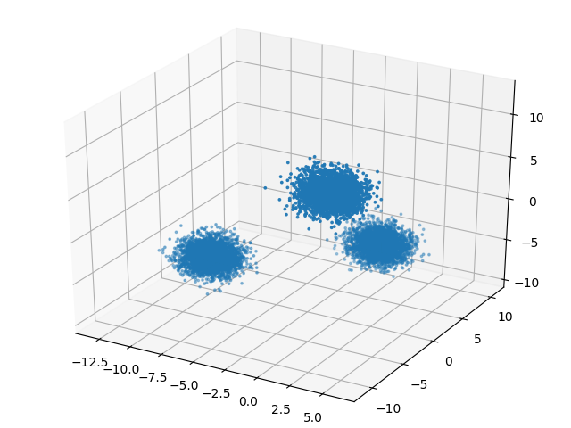

# MeanShift

C++ implementation of the [mean shift](https://en.wikipedia.org/wiki/Mean_shift) clustering algorithm with OpenMP.

In this README you will find instructions about how to compile the program and how to execute it. In the directory `paper` there is a technical paper about the algorithm and the comparison of the sequential version with the parallel version.

## Compiling

If you are used to CLion, you could open the directory `MeanShift` with the IDE. You will find all the necessary build configurations.

Otherwise, go to the `MeanShift` directory, create a build folder and change directory to that folder:

    $ cd Meanshift
    $ mkdir build
    $ cd build

Then you can compile the program in two versions:

* A sequential version:

    $ cmake -DCMAKE_BUILD_TYPE=Release ../
    $ make meanshift

* A parallel version, with OpenMP:

    $ cmake -DCMAKE_BUILD_TYPE=Release DCMAKE_CXX_FLAGS=-fopenmp ../
    $ make meanshift

The parallel version will be much faster, because it uses the OpenMP directives to perform multithreading operations.

## Usage

The result of the compilation is an executable called `meanshift`. It takes as input a CSV file containing the points to cluster and the bandwidth parameter of the mean shift algorithm. The points in the CSV file must be all of the same dimension (each row of the CSV file must contains the **same number of columns**) and there must be **only numerical values**. To get the clustering result, you must append to the command the string `--write-output <filename>`: the program will generate a file `<filename>.csv` containing the points where the last number of each row is the cluster to which the point belongs.

In the directory `ClusteringTests/datasets` there are ten datasets of 10000 points each.

I **strongly reccomend** you to use the python script `plot_clusters.py` in `ClusteringTests` to execute the program and plot the results. It requires Python >= 3.5, numpy and matplotlib. `plot_clusters.py` take as input the CSV file and the bandwidth parameter. Pay attention where the `meanshift` executable is located, you could set the right path in the script `plot_clusters.py`.

## Example

The dataset `data8.csv` contains 10000 points distributed in three gaussian blobs with standard deviation 1.

If we execute the mean shift algorithm with bandwidth 1 we get exactly the three clusters:

    $ python plot_clusters datasets/data8.csv 1
    File: datasets/data8.csv
    Number of points: 10000
    Number of dimensions: 3
    Number of clusters: 3
    Elapsed time: 6.66942 s

If we increase the bandwidth value to 10, then all the points will go in the same cluster:

    $ python plot_clusters.py datasets/data8.csv 10
    File: datasets/data8.csv
    Number of points: 10000
    Number of dimensions: 3
    Number of clusters: 1
    Elapsed time: 22.963 s

## Speedup

The file `speedup` in `ClusteringTests` is a BASH script that execute the sequential version and then execute different parallel versions with a different number of threads to estimate the speedup obtained by parallelizing the algorithm.

The results and the analysis of the speedup is described in the technical paper in the directory `paper`.
